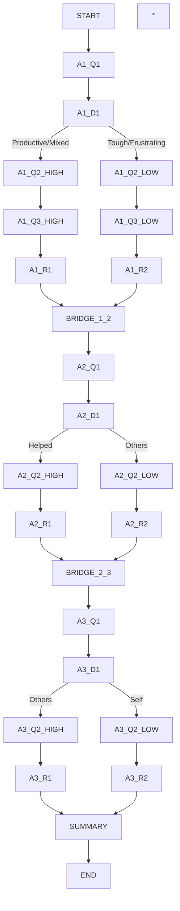

## 🌳 Reflection Flow (Diagram)

```mermaid
flowchart TD
    START --> A1_Q1
    A1_Q1 --> A1_D1

    A1_D1 -->|Productive/Mixed| A1_Q2_HIGH
    A1_D1 -->|Tough/Frustrating| A1_Q2_LOW

    A1_Q2_HIGH --> A1_Q3_HIGH --> A1_R1
    A1_Q2_LOW --> A1_Q3_LOW --> A1_R2

    A1_R1 --> BRIDGE_1_2
    A1_R2 --> BRIDGE_1_2

    BRIDGE_1_2 --> A2_Q1 --> A2_D1

    A2_D1 -->|Helped| A2_Q2_HIGH
    A2_D1 -->|Others| A2_Q2_LOW

    A2_Q2_HIGH --> A2_R1
    A2_Q2_LOW --> A2_R2

    A2_R1 --> BRIDGE_2_3
    A2_R2 --> BRIDGE_2_3

    BRIDGE_2_3 --> A3_Q1 --> A3_D1

    A3_D1 -->|Self| A3_Q2_LOW
    A3_D1 -->|Others| A3_Q2_HIGH

    A3_Q2_HIGH --> A3_R1
    A3_Q2_LOW --> A3_R2

    A3_R1 --> SUMMARY
    A3_R2 --> SUMMARY

    SUMMARY --> END

'''


```
